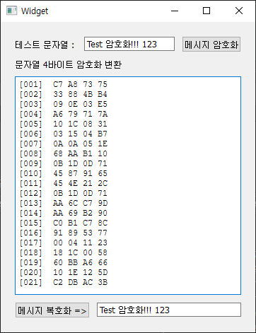

# QtRndTest

Qt 6.10 버전으로 만든 암호화 입니다.
1Byte 의 2, 3, 3 비트를 3바이트화 한후 crc8로 검증 데이터도 삽입한 것 입니다.

​build/Desktop_Qt_6_10_2_MSVC2022_64bit-Release/release
폴더의 exe 를 실행하셔도 됩니다.

​

PS.
암호화를 위해 데이터 용량을 늘린것 입니다.
암호화 후 꼭 같은 크기를 고집할 필요는 없다고 봅니다.

